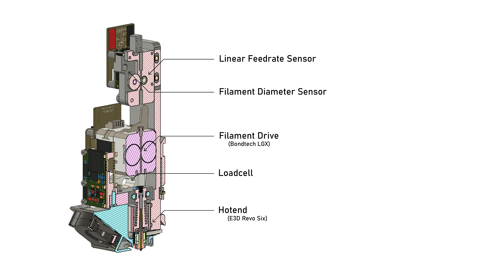
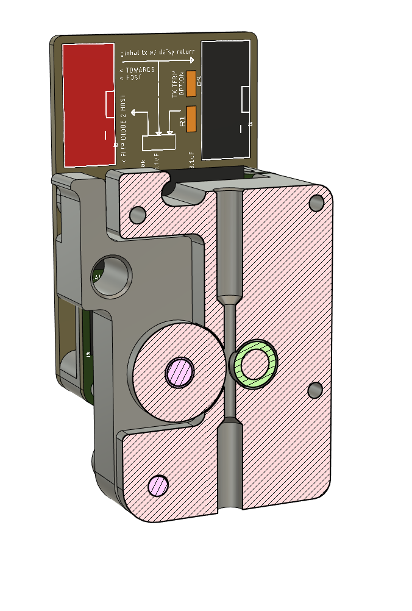
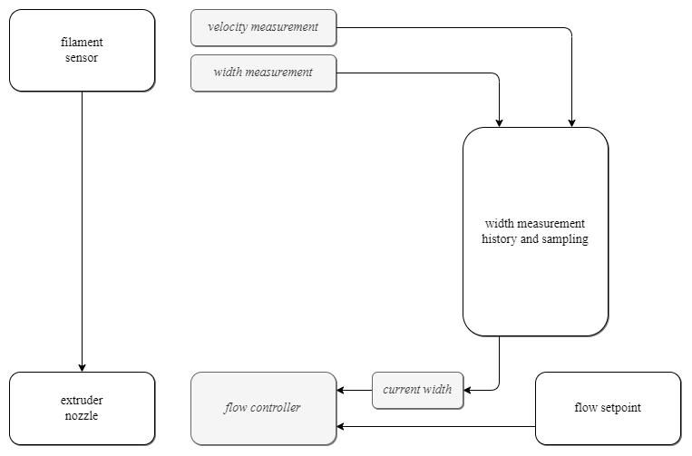

# Realtime Filament Width Measurement and Correction 

> Originally published to https://github.com/jakeread/realtime-filament-width-measurement-and-correction on March 13th, 2025 

> I hereby declare the contents of this disclosure to the public domain so that it may serve as prior art. 

I suspect that this device / idea / disclosure will be obvious to many folks in Fused Filament Fabrication 3D Printing, in fact I am quite sure I have heard mention of it elsewhere before, but I have been building a device and controller to execute on this and it comes time to put a stake in the ground, no matter how adhoc. The disclosure *does not* grant any rights to me specifically - this is for everyone, and would only serve to improve anyone else's (already public) disclosures. 

The gist is very simple: because filament that is extruded into FFF hotends varies in diameter slightly over its length, extrudate flow is impossible to control perfectly if we do not measure the filament's actual width on its way into the hotend. Instead of relying on a feed-forward assumption about filament width, we can measure it as it is being deployed, and use that information in our flow controller. 

  
> A filament sensor installed on an FFF end effector. 

This version of a filament sensor is simple: we apply two roller wheels to the filament path, 

  
> A closer view of a filament sensor. This device (shown in section) has an idler wheel (at left) mounted on a moveable arm, and an encoder wheel (at right). Both pinch the filament slightly. The encoder wheel's rotations are picked up and sense filament linear velocity. The idler wheel, which is pushed away from the encoder wheel when the filament's diameter increases, is mounted on an arm - the arm's displacement is measured (using a hall effect sensor in this case). The displacement is correlated to the filament's width.

Using this data in an FFF printers' controller is another matter. To do this, we need to keep track of the section of filament whose width we have measured as it travels towards the nozzle, where the measurement becomes relevant. 

> A diagram for control using width measurements. The primary challenge is that width measurements are made ahead of the time when they become relevant (i.e. where the measured length of filament is in the melt zone). To handle this, we can develop a software component that ingests width measurements, and also track's the filaments' velocity at any given time. Using the velocities, the software component tracks the position of each measurement. When the component needs to return a measurement that is currently relevant, it picks a measurement whose position is *at the nozzle* - i.e. whichever most recent measurement has moved from the sensor to the nozzle in the interval. 

In the proposed solution, we keep a kind of 'virtual' strand of filament in a software object, whose length is tagged with width measurements. When the filament advances, we read the filament's velocity (or we can read it from a feed-forward controller), and stamp our measurements at a new pieces of the virtual filament accordingly. There are many ways to do this, but the end results is that we have a buffer of values each containing a width measurement, and a displacement - the distance that the measured length has travelled from the measuring site since the measurement was made. Using the displacements, we can easily sample for a width along any length of the filament (so long as it has travelled through the sensor at *some* point) - i.e. pulling a sample from the location of the nozzle. 

The data is integrated into a flow controller - this can be very simple (i.e. if the filament in the melt zone is undersized, add more extruder velocity for the same flowrate setpoint - and vise/versa) - or can be complex, i.e. using it as the input into a predictive flow model that uses many more variables to predict outcomes. 

## Advantages

Filaments are difficult to manufacture at precise, repeatable diameters... adding width feedback makes it possible to use lower precision (cheaper) filaments while achieving similar output precisions. 

Filament widths have obvious effect on melt flow dynamics, and data from this sensor can be used to better inform model building datasets. 

## Enumerations 

The width measurement can be made with any number of devices. This example shows a roller wheel with a physical displacement sensor based on hall effect, others could use laser profilometry directly on the filament, visual flow sensors and CV width detection, etc. 

Width measurements could be improved by adding multiple sensors at different spans of the diameter, i.e. to cover cases where filament has an elliptical section, rather than the assumed circular section.

Measurements taken using roller wheels (which compress filament ever so slightly) could be improved by modeling the force exerted by the wheel on the filament, and the filament's hardness and modulus, and calibrating the measurement accordingly (i.e. so that squishy filament widths' are not under-reported). 

The control pathway described here shows the sensor's velocity measurement being used to estimate when a certain width of filament is being extruded. For sensors with no velocity measurement, we could easily use the extruder's motor velocity in place of this measurement (although at slightly less precision). 

It is not exactly the case that a given 'section' of filament is being extruded at one time, since the hotend's melt zone contains more complex dynamics. To compensate for these, width measurements may be used by a melt flow *model* rather than as a simple extrusion velocity correction factor. 

## References

I discussed these topics during my thesis proposal *on December 12th, 2024* which is included here as a [PDF](assets/jake-read-mit-thesis-proposal.pdf) and available from MIT archives on request. Slides for the proposal are public [here](https://jakeread.github.io/slides/2024-12_proposal/2024-12_proposal.html) and the proposal site is public [here](https://jakeread.github.io/thesis-proposal/) 

> Kazmer, David O., Austin R. Colon, Amy M. Peterson, and Sun Kyoung Kim. 2021. “Concurrent Characterization of Compressibility and Viscosity in Extrusion-Based Additive Manufacturing of Acrylonitrile Butadiene Styrene with Fault Diagnoses.” Additive Manufacturing 46 (October): 102106. https://doi.org/10.1016/j.addma.2021.102106. 

> Wu, Pinyi. 2024. “Modeling and Feedforward Deposition Control in Fused Filament Fabrication.”